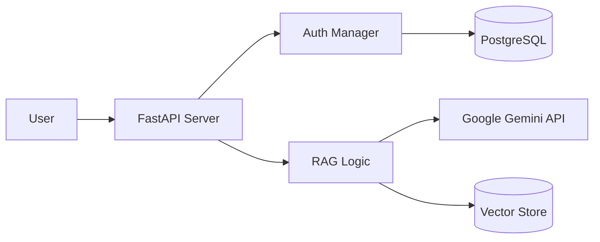

# AI-Powered Mock Test Platform (CAT/GATE)


A mission-critical backend platform for conducting mock standardized tests (CAT and all 30 GATE streams). This project implements an intelligent, AI-driven question generation engine using an offline-to-online RAG (Retrieval-Augmented Generation) pipeline, combined with a robust role-based authentication system and comprehensive exam subject mapping.

## Table of Contents
- [Tech Stack & Architecture](#tech-stack--architecture)
- [Prerequisites](#prerequisites)
- [Installation & Local Setup](#installation--local-setup)
- [Usage & Running the App](#usage--running-the-app)
- [Testing](#testing)
- [Deployment](#deployment)
- [Contributing Guidelines](#contributing-guidelines)
- [License and Contact](#license-and-contact)

## Tech Stack & Architecture

### Core Technologies
- **Backend API**: `FastAPI` (High-performance ASGI framework)
- **AI / LLM Orchestration**: `Google Gemini API` (gemini-1.5-flash)
- **RAG Pipeline**: `Vector Search` (for indexing question contexts from PDFs)
- **Database**: `PostgreSQL` (User management, subscriptions, and scores)
- **Auth**: `JWT` (Secure, stateless tokens with role-based access)
- **Dependency Management**: `uv`

### High-Level Architecture
The platform is decoupled into three primary modules:
1. **`data_pipeline/`**: Processes raw PDF sources into structured JSON and creates a persistent vector store for RAG queries.
2. **`fastapi_app/`**: The main live server handling API requests, authentication, and dynamic question synthesis.
3. **`app_data/`**: Persistent storage for indexed vector datasets and processed exam materials.



## Prerequisites
- **Python**: Version 3.10+
- **Database**: PostgreSQL server running (default port 5432).
- **Tools**: `uv` package manager installed globally.

## Installation & Local Setup

```bash
git clone https://github.com/The-Vaibhav-Yadav/OELP.git
cd OELP
uv sync
```

### Environment Variables
Configure the application by creating a `.env` file in the `fastapi_app/` directory:
```bash
# Security secret (generate with: openssl rand -hex 32)
SECRET_KEY="your_secure_secret"

# AI Configuration
GEMINI_API_KEY="your_gemini_api_key_here"

# Database Configuration
DB_USER="my_app_user"
DB_PASSWORD="your_secure_password"
DB_HOST="localhost"
DB_PORT="5432"
DB_NAME="mock_test_db"
```

## Usage & Running the App

### Phase 1: Data Pre-processing (Injesting Exam Content)
1. Add your source PDF materials to `data_pipeline/source_pdfs/CAT/` or `GATE/`.
2. Parse PDFs into structured JSON:
   ```bash
   uv run python -m data_pipeline.scripts.parse_pdfs
   ```
3. Build the semantic vector index:
   ```bash
   uv run python -m data_pipeline.scripts.build_vector_db
   ```

### Phase 2: Start the Web API
Launch the FastAPI development server:
```bash
cd fastapi_app
uv run uvicorn main:app --reload
```
The server will start on **`http://localhost:8000`**. You can access interactive documentation at **`/docs`**.

## Testing
Unit and integration tests for the mock test logic:
- **Command**: `uv run pytest`
- **Focus**: Validates authentication flows, token expiration, and RAG retrieval consistency.

## Deployment
Recommended deployment strategy:
- **Database**: Managed PostgreSQL instance (e.g., AWS RDS).
- **Application**: Containerized using Docker and deployed to a scalable cloud service like AWS App Runner or Render.
- **CI/CD**: Utilize GitHub Actions to run tests and rebuild the vector store on new content merges.

## Contributing Guidelines
1. Follow **GitFlow** branching.
2. Ensure all commits use **Conventional Commit** formatting.
3. Strict adherence to **PEP-8** and `ruff` linting.
4. **Pull Requests**: Must pass all existing tests before code review as defined in GitHub Actions.

## License and Contact
- **License**: MIT
- **Author**: Vaibhav Yadav (https://github.com/The-Vaibhav-Yadav)